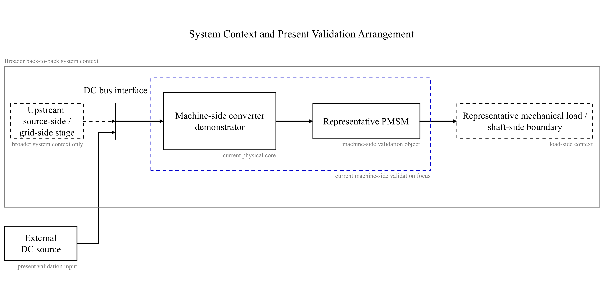

# System Context

> **Status (Phase 1 – System-Context Baseline):**  
> This document defines the system-context baseline for the 30 kW-class water-cooled PMSM drive/converter platform.  
> Its scope is limited to broader back-to-back system reading, the role of the machine-side converter demonstrator, the present validation arrangement, and demonstrator boundary.  
> Detailed design-basis reasoning, hardware-platform baselining, control architecture, bring-up/debug evidence, and representative validation artefacts are deferred to subsequent phases.

---

## 1. System-Context Overview

**Figure 1.** System-context overview placing the machine-side converter demonstrator within the broader back-to-back system context. In the present validation arrangement, the upstream source-side / grid-side function is represented by an external DC source. The current machine-side validation focus remains limited to the machine-side converter demonstrator and the representative PMSM, while the mechanical-load block is shown only as the shaft-side boundary within the broader system context.

The figure separates three levels of meaning:

- the broader back-to-back system context, which defines the upstream source-side / grid-side function, the DC bus interface, the machine-side converter role, and the downstream shaft-side boundary
- the present validation arrangement, in which that upstream function is represented by an external DC source rather than by a physically implemented source-side / grid-side stage
- the current machine-side validation focus, centred at this stage on the machine-side converter demonstrator and the representative PMSM

---

## 2. Broader System Context

The project is positioned within a broader back-to-back system context rather than as an isolated standalone converter.

At this level, the system is read through three functional layers: an upstream source-side / grid-side function, an intermediate DC bus interface layer, and a machine-side conversion function linked to PMSM drive operation. Retaining this broader view preserves system role, interface boundary, and the interpretation of later validation artefacts.

The purpose of this section is to define the general system reading required at the present repository stage, rather than to introduce detailed subsystem design, device-level definition, or control-layer commitments.

---

## 3. Role of the Machine-Side Converter

Within that broader system view, the machine-side converter is the project’s physical core.

It serves as the repository’s only physical mainline because it is the part through which implementation depth, converter–drive integration, sensing, cooling, protection, subsequent bring-up, and measured evidence can be organised in a coherent demonstrator form.

Accordingly, the machine-side converter is not treated as one subsystem among parallel physical implementation lines. It is the demonstrator around which the present repository is deliberately structured.

---

## 4. Present Demonstrator Boundary

The present demonstrator should be read as a machine-side converter demonstrator within a broader back-to-back system context.

At the present repository stage, the machine-side converter demonstrator is the only physical mainline. Source-side / grid-side context is retained to preserve system-level interpretation, but it is not established as a parallel physical implementation line.

Accordingly, the repository is not positioned as a full dual-side hardware closure. The retained broader system context should therefore be read as preserved system meaning rather than as a claim of parallel physical build depth across multiple hardware branches.

---

## 5. External DC Source Substitution

Within the present validation arrangement, the upstream side is represented by an external DC source.

At system-context level, the external DC source provides upstream representation at the DC bus interface. It allows the machine-side converter demonstrator to be read within a broader back-to-back system context while keeping the physical mainline at machine-side level.

This substitution is appropriate at the present repository stage because it supports machine-side physical implementation and later validation-oriented work without requiring full dual-side hardware build-out at the same stage.

It does not establish source-side / grid-side hardware closure, nor should it be read as evidence that a second physical mainline has been implemented or validated.

---

## 6. Rationale for the Machine-Side Focus

At the present repository stage, the project focuses on machine-side in order to preserve demonstrator legitimacy and implementation depth rather than distribute limited physical implementation effort across multiple partially developed hardware lines.

Retaining broader system context does not indicate an absence of system understanding. Instead, it preserves the engineering reading needed to interpret the demonstrator within the broader converter chain and its interface role.

PC-side tools and MATLAB-based tools may later support bring-up, observability, analysis, and tuning, but they remain part of a support chain rather than a second physical mainline.

---

## 7. Reading Boundary at This Stage

At this stage, the project should be read as a machine-side converter engineering demonstrator within a broader back-to-back system context.

It is therefore not positioned as an isolated standalone DC-AC converter project without broader system context, nor as a fully implemented dual-side hardware platform. The retained broader system view provides system-level interpretation, while the present physical mainline provides implementation depth.

More detailed design-basis reasoning, hardware-platform evidence, control architecture, bring-up/debug evidence, and representative validation artefacts are deferred to later phases as substantive engineering content becomes available.